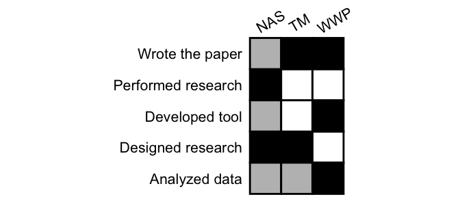
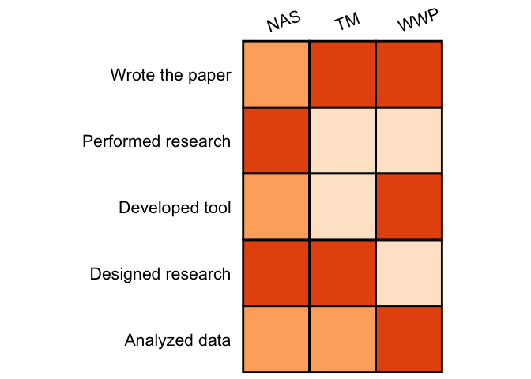
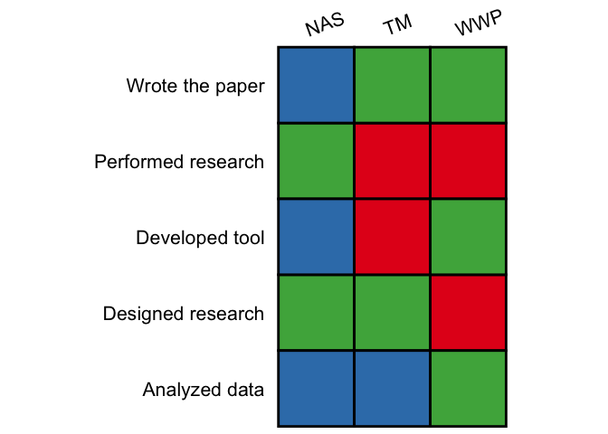
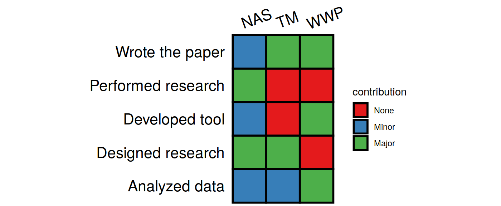

<!-- README.md is generated from README.Rmd. Please edit that file -->

# contribution

<!-- badges: start -->

[](https://ci.appveyor.com/project/ShixiangWang/contribution)
[](https://travis-ci.org/ShixiangWang/contribution)
[](https://cran.r-project.org/package=contribution)
<!-- badges: end -->

The goal of **contribution** is to generate **contribution table** for
credit assignment in a project. This is inspired by Nick Steinmetz (see
twitter
<https://twitter.com/SteinmetzNeuro/status/1147241138291527681>).

> Authors contributions sections are new and still don’t appear in major
> journals, but can be improved. Rather than text listing each author’s
> contributions, the same data can be presented as a table with rows
> corresponding to contributions and columns for each author.
> 
> Advantages include:
> 
> 1.  Graphics are faster and easier to comprehend. They are also easier
>     to locate in the document.
> 
> 2.  This format can be readily augmented with additional information,
>     such as distinguishing between ‘major’ and ‘minor’ contributions
>     of each type.
> 
> 3.  This format can be read as easily in either direction, answering
>     both “Who did X?” and “What did person Y do?” equally.
> 
> 4.  This format lends itself to a nice extension for including your
>     author contribution information on your CV: a similar table where
>     each column is one of your papers.
> 
> A difficulty with this is the diversity of terminology used, which
> would be helped by refinement and more widespread adoption of the
> CRediT framework (<https://www.casrai.org/credit.html> ).

## Installation

~~You can install the released version of contribution from
[CRAN](https://CRAN.R-project.org) with~~:

``` r
install.packages("contribution")
```

And the development version from [GitHub](https://github.com/) with:

``` r
# install.packages("devtools")
devtools::install_github("ShixiangWang/contribution")
```

## Example

### Basic

This is a basic example which shows you how to plot a simple
contribution table:

``` r
library(contribution)
data("demo")
demo
#> # A tibble: 5 x 4
#>   Class              WWP   NAS   TM   
#>   <chr>              <chr> <chr> <chr>
#> 1 Designed research  <NA>  Major Major
#> 2 Performed research <NA>  Major <NA> 
#> 3 Developed tool     Major Minor <NA> 
#> 4 Analyzed data      Major Minor Minor
#> 5 Wrote the paper    Major Minor Major
```

``` r
generate(demo)
```



The **white** box represents **no contribution**, the **grey** box
represents **minor contribution**, and the **black** box represents
**major contribution**.

The table is nice, easy to read. The result is a `ggplot` object, so you
can modify in your way\!

You can also use other colors and `scale_fill_*` function from
**ggplot2** to map colors

``` r
library(ggplot2)
generate(demo, text_angle_x = 20, color_map = scale_fill_brewer(palette ="Oranges"))
```



``` r
generate(demo, text_angle_x = 20, color_map = scale_fill_brewer(palette ="Set1"))
```



It is not easy to see the meaning of color, so show the
legend.

``` r
generate(demo, text_angle_x = 20, color_map = scale_fill_brewer(palette ="Set1"), show_legend = TRUE)
```



### CRediT

**CRediT** can help assign the role, this data has been stored in this
package.

``` r
data("CRediT")
```

Show whole table.

``` r
knitr::kable(CRediT, format = "html")
```

<table>

<thead>

<tr>

<th style="text-align:left;">

Role

</th>

<th style="text-align:left;">

Definition

</th>

</tr>

</thead>

<tbody>

<tr>

<td style="text-align:left;">

Conceptualization

</td>

<td style="text-align:left;">

Ideas; formulation or evolution of overarching research goals and aims.

</td>

</tr>

<tr>

<td style="text-align:left;">

Data curation

</td>

<td style="text-align:left;">

Management activities to annotate (produce metadata), scrub data and
maintain research data (including software code, where it is necessary
for interpreting the data itself) for initial use and later re-use.

</td>

</tr>

<tr>

<td style="text-align:left;">

Formal analysis

</td>

<td style="text-align:left;">

Application of statistical, mathematical, computational, or other formal
techniques to analyse or synthesize study data.

</td>

</tr>

<tr>

<td style="text-align:left;">

Funding acquisition

</td>

<td style="text-align:left;">

Acquisition of the financial support for the project leading to this
publication.

</td>

</tr>

<tr>

<td style="text-align:left;">

Investigation

</td>

<td style="text-align:left;">

Conducting a research and investigation process, specifically performing
the experiments, or data/evidence collection.

</td>

</tr>

<tr>

<td style="text-align:left;">

Methodology

</td>

<td style="text-align:left;">

Development or design of methodology; creation of models.

</td>

</tr>

<tr>

<td style="text-align:left;">

Project administration

</td>

<td style="text-align:left;">

Management and coordination responsibility for the research activity
planning and execution.

</td>

</tr>

<tr>

<td style="text-align:left;">

Resources

</td>

<td style="text-align:left;">

Provision of study materials, reagents, materials, patients, laboratory
samples, animals, instrumentation, computing resources, or other
analysis tools.

</td>

</tr>

<tr>

<td style="text-align:left;">

Software

</td>

<td style="text-align:left;">

Programming, software development; designing computer programs;
implementation of the computer code and supporting algorithms; testing
of existing code components.

</td>

</tr>

<tr>

<td style="text-align:left;">

Supervision

</td>

<td style="text-align:left;">

Oversight and leadership responsibility for the research activity
planning and execution, including mentorship external to the core team.

</td>

</tr>

<tr>

<td style="text-align:left;">

Validation

</td>

<td style="text-align:left;">

Verification, whether as a part of the activity or separate, of the
overall replication/reproducibility of results/experiments and other
research outputs.

</td>

</tr>

<tr>

<td style="text-align:left;">

Visualization

</td>

<td style="text-align:left;">

Preparation, creation and/or presentation of the published work,
specifically visualization/data presentation.

</td>

</tr>

<tr>

<td style="text-align:left;">

Writing – original draft

</td>

<td style="text-align:left;">

Preparation, creation and/or presentation of the published work,
specifically writing the initial draft (including substantive
translation).

</td>

</tr>

<tr>

<td style="text-align:left;">

Writing – review & editing

</td>

<td style="text-align:left;">

Preparation, creation and/or presentation of the published work by those
from the original research group, specifically critical review,
commentary or revision – including pre- or post-publication stages.

</td>

</tr>

</tbody>

</table>

## To do

  - Support special symbol for indicating equal work in a project/paper
  - Support numeric contributions
  - Support GitHub API to grep contributions for projects
  - A shiny or addin of RStudio, maybe?
